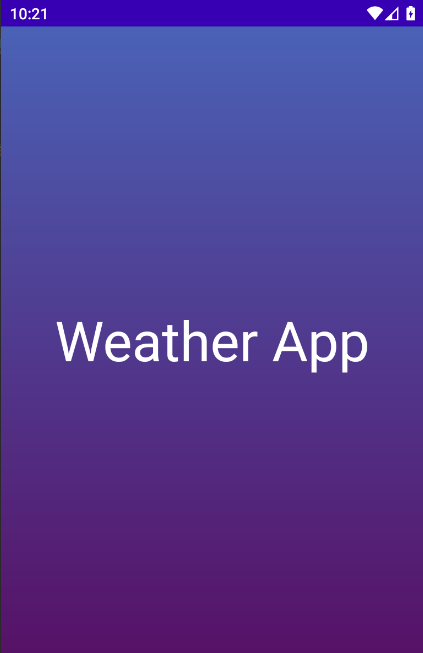
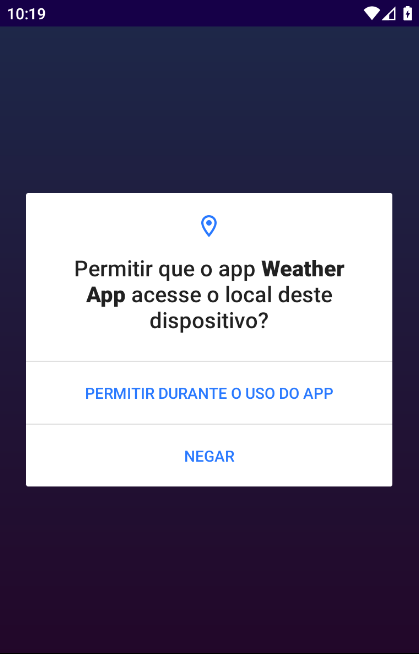
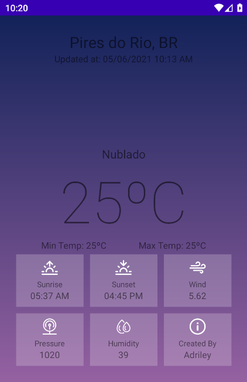

# WeatherApp
Wheater APP, aplicação Android para exibição de dados climáticos locais. 

Tecnologias:
<ul>
  <li>Android Studio</li>
  <li>Kotlin</li>
  <li>Open Weather Map API </li>
  <li>JSON</li>
</ul>

 

Screenshots:

 

<figure>
	
	<figcaption>Splash Screen </figcaption>
</figure>

 

 

<figure>
	
	<figcaption>Permissão em tempo real </figcaption>
</figure>

 

 

<figure>
	
	<figcaption>Tela principal </figcaption>
</figure>
  
